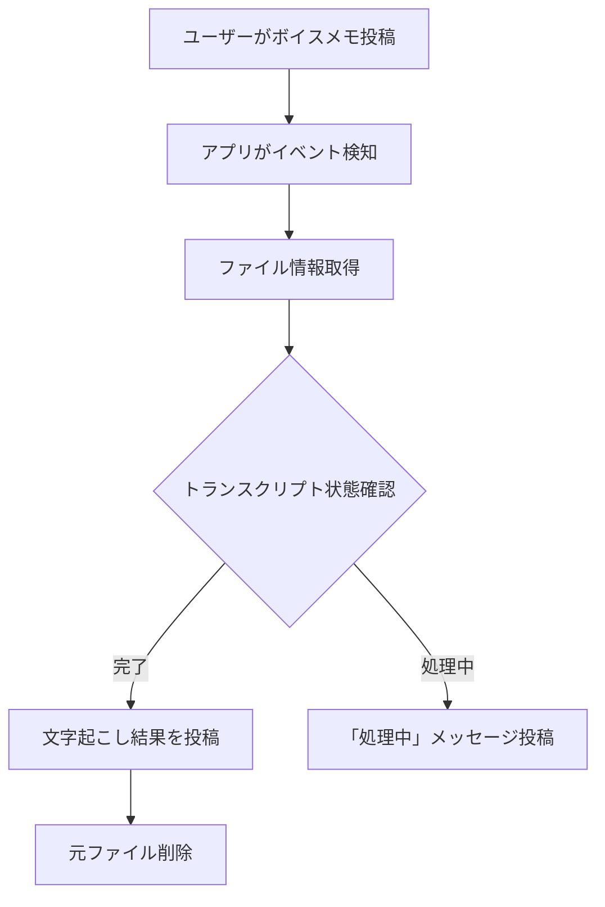

# 🎤 Slack ボイスメモ文字起こしコンバーター

> Slackのボイスメモを自動文字起こし＆再投稿するGAS（Google Apps Script）アプリケーション

## ✨ 特徴

- 📱 Slackボイスメモの自動検知とトランスクリプション
- 🔄 Slackネイティブ文字起こし機能の活用
- 💬 文字起こし結果をリッチテキストで再投稿
- 🗑️ トランスクリプション完了後の自動クリーンアップ
- 📊 詳細なログ記録システム

## 🔄 処理フロー



## 🛠️ セットアップ

### GAS プロジェクト設定

1. [Google Apps Script](https://script.google.com/)で新規プロジェクト作成
2. 提供されたコードをファイルにコピー
3. ウェブアプリとしてデプロイ:
   - デプロイタイプ: `ウェブアプリ`
   - アクセス: `全員（匿名を含む）`
   - デプロイURLをコピー（Slack API設定用）

### Slack API 設定

| 手順 | 詳細 |
|------|------|
| 1. アプリ作成 | [Slack API](https://api.slack.com/apps)で新規アプリ作成 |
| 2. イベント設定 | Event Subscriptionsを有効化し、GASのURLを登録 |
| 3. 必要なイベント | `message.channels`、`file_shared` |
| 4. Bot Token権限 | `channels:history`、`channels:read`、`chat:write`、`files:read` |
| 5. User Token権限 | `files:write`、`chat:write` |
| 6. ワークスペースインストール | トークン（Bot・User）を取得 |

### GAS 初期設定関数

```javascript
// ログ用スプレッドシート設定
setupLogSpreadsheet();

// APIトークン設定
function setupCredentials() {
  const botToken = 'xoxb-...';  // ボットトークン
  const userToken = 'xoxp-...'; // ユーザートークン
  const channelName = 'times-...'; // 監視チャンネル（オプション）
  
  saveCredentials(botToken, userToken, channelName);
}

// トークン検証
function testTokens() {
  // トークン権限を検証
  validateTokenPermissions(botToken, 'ボット');
  validateTokenPermissions(userToken, 'ユーザー');
}
```

## 🔧 カスタマイズ

| 項目 | 方法 |
|------|------|
| メッセージ形式 | `postTranscription()`内のブロックを編集 |
| ファイル削除無効化 | `useSlackTranscription()`内の削除コードをコメントアウト |
| 手動トランスクリプト確認 | `checkFileTranscription('FILE_ID')`を実行 |

## ⚠️ トラブルシューティング

### 一般的な問題

- **イベント未検出**: URL検証、チャンネル招待、権限確認
- **文字起こし失敗**: Slack機能有効化確認、`files:read`権限確認
- **ファイル未削除**: ユーザートークン設定・権限確認、トランスクリプション完了確認

### 詳細確認

- ログスプレッドシートで詳細なエラーメッセージを確認
- `setupLogSpreadsheet()`実行で自動作成

## 📝 備考

- **精度**: Slack内部文字起こしは言語・音質により変動
- **処理時間**: トランスクリプション完了まで遅延の可能性あり
- **トークン**: ユーザートークンは定期的な更新が必要な場合あり

## 📈 バージョン履歴

| バージョン | 変更内容 |
|------------|----------|
| v1.0.0 | 初回リリース 20250403 |

---

*MIT License*